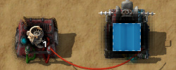
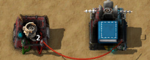
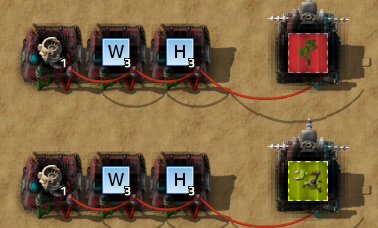
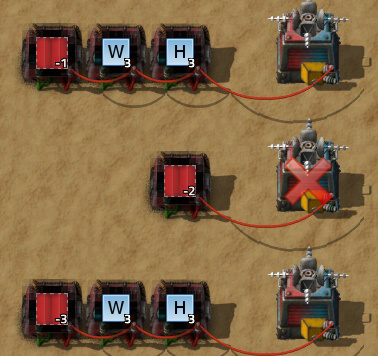
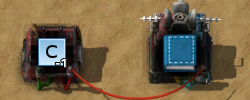

Adds a Blueprint Deployer chest which can be connected to the circuit network to build a self-expanding factory.

Example commands:

Deploy blueprint. Construction robot signal can be any value ≥ 1.

---

Deploy blueprint from book. Construction robot signal selects which blueprint to use.  If it is greater than the size of the book, the active blueprint is used instead.

---

Deconstruct area. W = width, H = height. The deployer chest will never deconstruct itself with this command. Supports deconstruction filters.

---

Cancel deconstruction in area.

---

Alternative deconstruction commands that do not require a deconstruction planner in the deployer chest.
-1 = Deconstruct area.
-2 = Deconstruct the deployer chest.
-3 = Cancel deconstruction in area.

---

Copy blueprint or blueprint book. The original blueprint must be in a chest (or inserter with read hand contents) on the same circuit network as the deployer chest.

---

Delete blueprint or blueprint book.

---

X and Y signals shift the position of the construction/deconstruction order.

R signal rotates the blueprint. R = 1 = 90° clockwise, R = 2 = 180°, R = 3 = 90° counterclockwise.

Blueprints are centered on: 1) The first wooden chest in the blueprint, 2) The first deployer chest in the blueprint, 3) The center of the blueprint.
